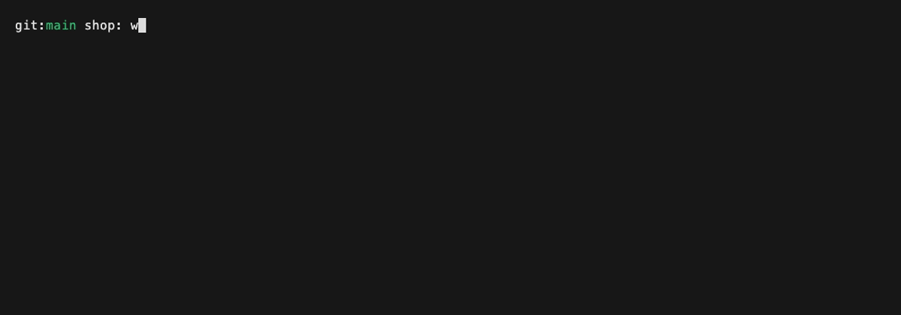
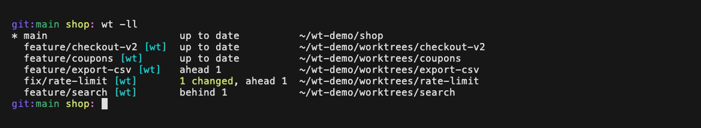
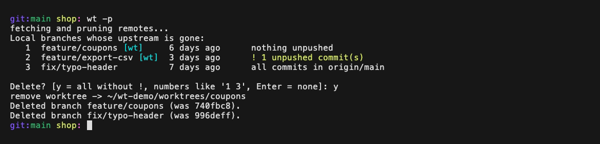

# zsh-wt

Jump between git worktrees by branch name, see them in `git log`, and clean
up the ones that were merged.


If you keep one worktree per branch, or let tools like Claude Code
(`.claude/worktrees/`) or Codex (`~/.codex/worktrees/`) create them for you,
you end up with a lot of worktrees in a lot of places. `wt` lets you address
all of them by branch name, wherever they live, and shows which branches you
can jump to right in your log graph.

- `wt checkout` jumps to the worktree of `feature/checkout-v2`
- `wtlog` marks branches with a worktree as `feature/checkout-v2 [wt]`
- `wt -ll` shows every worktree with its changes and upstream status
- `wt -p` finds branches that were merged and deleted upstream and removes
  them together with their worktrees, after checking nothing gets lost

It works with any worktree, however it was created.

## Install

Requirements:

| Dependency | Required | Used for |
|------------|----------|----------|
| zsh | yes | everything (tested with 5.9) |
| git >= 2.31 | yes | everything |
| perl 5 | for `wtlog` | rewriting the log decorations; preinstalled on macOS and most Linux distributions |
| [fzf](https://github.com/junegunn/fzf) | no | picking between several matches of `wt <substring>` |

**Manually**

```zsh
git clone https://github.com/wellle/zsh-wt ~/.zsh/zsh-wt
```

and in `~/.zshrc`, before or after `compinit`:

```zsh
source ~/.zsh/zsh-wt/wt.plugin.zsh
```

**[oh-my-zsh](https://github.com/ohmyzsh/ohmyzsh)**

```zsh
git clone https://github.com/wellle/zsh-wt ${ZSH_CUSTOM:-~/.oh-my-zsh/custom}/plugins/wt
```

and add `wt` to `plugins=(...)` in `~/.zshrc`.

**[antidote](https://github.com/mattmc3/antidote)**: add `wellle/zsh-wt` to
`~/.zsh_plugins.txt`.

**[zinit](https://github.com/zdharma-continuum/zinit)**: `zinit light wellle/zsh-wt`

## Usage

```
usage: wt [-h | -l | -ll | -p | -d|-D] [branch]
  wt              jump to main worktree
  wt <branch>     jump to worktree for branch (unique substring works too)
  wt -l           list worktrees (* = current, [wt] = linked)
  wt -ll          list worktrees with changes and upstream status
  wt -p           delete branches whose upstream is gone, and their worktrees
  wt -d <branch>  remove linked worktree for branch
  wt -D <branch>  remove linked worktree and delete branch
  wt -h           show this help
```

### Jumping

`wt <branch>` changes into the worktree that has `<branch>` checked out.
If no branch has that exact name, any branch containing it works, ignoring
case: `wt checkout` or `wt CHECK` both find `feature/checkout-v2`. When
several branches match, `wt` opens fzf to pick one, or lists them if fzf is
not installed. Plain `wt` goes back to the main worktree.



Tab completion offers the branches that have a worktree and also matches
substrings, so `wt check<Tab>` completes to `feature/checkout-v2`.

### Listing

`wt -l` lists all worktrees with the name to pass to `wt`. `*` marks the
one you are in, `[wt]` marks linked worktrees (everything but the main one).
`wt -ll` adds uncommitted changes and how each branch compares to its
upstream:



`wt -ll` runs `git status` in every worktree, so it takes a moment in big
repositories.

### Cleaning up

`wt -p` fetches with `--prune`, then lists the local branches whose upstream
is gone, which usually means they were merged and deleted on GitHub. That
includes branches without a worktree. Nothing is deleted until you answer:



- `y` deletes all branches not flagged with `!`
- numbers like `1 3` delete exactly those, flagged or not
- Enter deletes nothing

Deleting a branch removes its linked worktree first, then the branch with
`git branch -D`, which prints the commit it pointed to, in case you need it
back. See [How `wt -p` decides](#how-wt--p-decides) below.

### Removing a single worktree

`wt -d <branch>` removes the worktree of a branch and keeps the branch.
`wt -D <branch>` deletes the branch too. Both need the exact branch name,
and refuse to remove the main worktree or the one you are in.

## Integrations

### git log

`wtlog` is a drop-in for `git log` that adds a cyan `[wt]` to every branch
in the ref decorations that is checked out in a linked worktree, so you can
see in your graph where `wt` can take you. Use it in your log aliases:

```zsh
alias gl='wtlog --graph --pretty=tformat:"%C(auto)%h - %s%d %C(yellow)(%ad) %C(reset)%an"'
alias gla='gl --branches --remotes HEAD'
```

It only tags colored decorations, so custom formats need `%C(auto)` before
`%d` or `%D`. That is also why it never touches commit subjects that happen
to contain a branch name. Output goes through your `GIT_PAGER` (or `less`),
and when piped it stays plain text. Without linked worktrees `wtlog` is just
`git log`.

### Prompt

`git_worktree_hint` prints a cyan `[wt] ` when you are in a linked worktree:

```zsh
setopt PROMPT_SUBST
PROMPT='$(git_worktree_hint)'"$PROMPT"
```

### Helpers

`wtpath <branch>` prints the path of a branch's worktree, and `wtmainpath`
the path of the main worktree, for use in your own scripts and aliases:

```zsh
code "$(wtpath feature/checkout-v2)"
```

## How `wt -p` decides

Squash and rebase merges create new commits, so `git branch --merged` does
not see these branches as merged, and your local branch may even be behind
what was merged if you rebased on GitHub. `wt -p` therefore takes "the
upstream is gone" as the sign that a branch is done, and then checks that
deleting it loses nothing:

| Verdict | Meaning |
|---------|---------|
| `all commits in origin/main` | every commit has a patch-identical commit on the remote's default branch, as after a rebase merge |
| `nothing unpushed` | every commit was on the remote branch before it was deleted, as after a squash merge |
| `! N unpushed commit(s)` | the branch has commits that never reached the remote |
| `! N commit(s) not in origin/main, remote tip unknown` | the remote branch was pruned before `wt -p` saw it (for example by your own `git fetch --prune`), so this cannot be verified |
| `! uncommitted changes` | the worktree has local changes |
| `! you are in this worktree` | `cd` elsewhere first |

The remote tips are only known until a fetch prunes them, so `wt -p`
remembers the tips it saw in `.git/wt-gone-tips` until those branches are
gone.

`wt -p` never forces anything: a worktree with uncommitted or untracked
files is left alone, and so is its branch. Branches without an upstream are
never listed, and neither is the branch of the main worktree.

## Limitations

- Detached worktrees show up in `wt -l`, but have no branch name to jump to.
- `wtlog` uses `GIT_PAGER`, not a `pager.log` setting.
- The plugin defines `wt`, `wtlog`, `wtpath`, `wtmainpath` and
  `git_worktree_hint`, plus internal helpers starting with `__wt_`.

## Development

```zsh
make test     # run the tests against a fresh demo repo
make demo     # build the demo repo in ~/wt-demo to try things out
make record   # re-record the README images, needs vhs
```

The demo repo has a small history, open and merged branches, and several
worktrees in different states. `source demo/zshrc` gives you the prompt used
in the recordings.

## License

MIT
